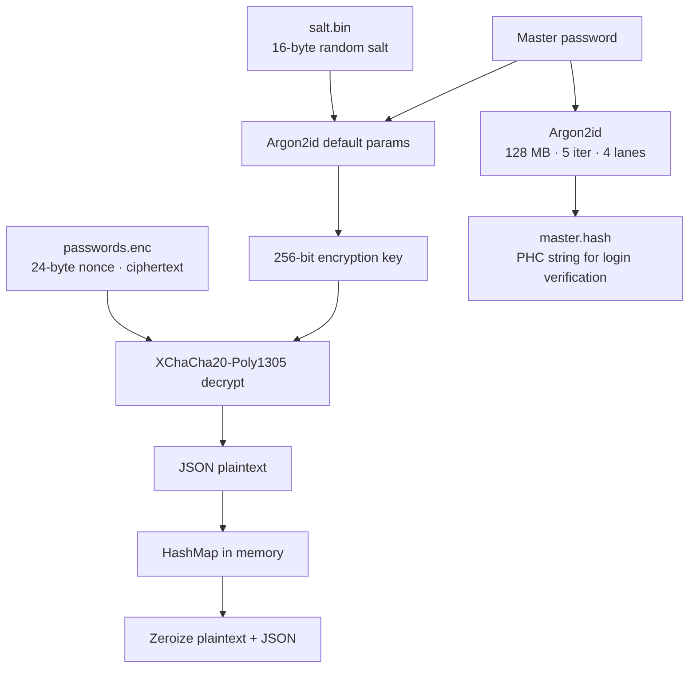

pm uses two cryptographic primitives: Argon2id for key derivation and XChaCha20-Poly1305 for authenticated encryption. Both are implemented in Rust using audited crates from the [RustCrypto](https://github.com/RustCrypto) project.

## Key derivation

Your master password is never stored directly. Instead, pm derives a 256-bit encryption key from it using Argon2id.

pm uses Argon2id in two distinct ways: once for **key derivation** (to produce the encryption key for the vault) and once for **master password verification** (to produce the stored hash in `master.hash`). These two operations use different parameters.

### Key derivation (for vault encryption)

When deriving the encryption key, pm uses `Argon2::default()`:

| Parameter | Value |
|-----------|-------|
| Algorithm | Argon2id (default variant) |
| Output length | 32 bytes (256 bits) |
| Salt | 16-byte random value, stored in `salt.bin` (hex-encoded) |

The derived 32-byte key is used directly as the XChaCha20-Poly1305 encryption key for `passwords.enc`.

### Master password hashing (for login verification)

When storing the master password hash in `master.hash`, pm uses explicit Argon2id parameters designed to make brute-force expensive:

| Parameter | Value |
|-----------|-------|
| Algorithm | Argon2id |
| Memory cost | 131072 KB (128 MB) |
| Time cost (iterations) | 5 |
| Parallelism (lanes) | 4 |
| Salt | Randomly generated per hash (embedded in the PHC string) |

Argon2id won the [Password Hashing Competition](https://www.password-hashing.net/) in 2015. The `id` variant combines the side-channel resistance of Argon2i with the GPU-resistance of Argon2d, making it the recommended choice for password-based key derivation.

The 128 MB memory requirement means an attacker cannot run thousands of parallel guesses on a GPU without a corresponding amount of GPU memory per lane. The 5-iteration time cost adds additional sequential work on top.

### Key derivation salt

The salt used for key derivation is a 16-byte random value generated once when the vault is first created. It is hex-encoded and stored in `salt.bin`. This salt is fixed per vault — it is not regenerated on each key derivation.

<Note>
  This salt is distinct from the per-operation salt embedded in the Argon2 master password hash stored in `master.hash`. The key derivation salt is an input to the encryption key computation; the hash salt is embedded in the PHC string alongside the master password verifier hash.
</Note>

### Master password verification

To verify the master password at login without storing it, pm hashes it separately using Argon2id and stores the result in `master.hash` using the PHC string format. This hash includes its own randomly generated salt and the full algorithm parameters.

```
$argon2id$v=19$m=131072,t=5,p=4$<base64-salt>$<base64-hash>
```

Verification parses this string and runs Argon2id with the embedded parameters and salt, then compares the output. The raw password is never written to disk.

## Vault encryption

The vault (`passwords.enc`) is encrypted with XChaCha20-Poly1305.

### Algorithm properties

| Property | Value |
|----------|-------|
| Algorithm | XChaCha20-Poly1305 |
| Key size | 256 bits (32 bytes) |
| Nonce size | 192 bits (24 bytes) |
| Authentication tag | 128 bits (16 bytes) |

XChaCha20-Poly1305 is an authenticated encryption with associated data (AEAD) scheme. It provides:

- **Confidentiality**: The ChaCha20 stream cipher encrypts the plaintext.
- **Integrity and authenticity**: The Poly1305 MAC authenticates the ciphertext. Any modification to the encrypted file causes decryption to fail.

The `X` prefix (XChaCha20) indicates the extended 192-bit nonce variant. The larger nonce eliminates nonce-collision risk when nonces are generated randomly — with 192 bits of entropy, the probability of a collision across billions of saves is negligible. XChaCha20-Poly1305 is used in TLS 1.3, WireGuard, and libsodium.

### File format

The encrypted vault file has a simple binary layout:

```
[ 24-byte nonce ][ XChaCha20-Poly1305 ciphertext + 16-byte auth tag ]
```

- The first 24 bytes are the nonce, stored in plaintext.
- The remaining bytes are the ciphertext produced by XChaCha20-Poly1305 (which appends the 16-byte authentication tag).

A fresh random nonce is generated for every save operation. This means two saves of identical vault contents produce different ciphertext.

### Plaintext format

Before encryption, the vault is serialized as a UTF-8 JSON object mapping entry names to passwords:

```json
{"github": "hunter2", "email": "correct-horse-battery"}
```

After encryption, the JSON string is zeroized from memory.

## Data flow



## Memory zeroization

pm uses the [`zeroize`](https://crates.io/crates/zeroize) crate to overwrite sensitive values in memory before they are dropped. The following values are zeroized after use:

- The master password string (after key derivation)
- The derived 256-bit key (implicitly via `Zeroize` on the array)
- The decrypted plaintext bytes
- The JSON string before and after serialization

<Tip>
  Zeroization reduces the window during which sensitive data is readable in process memory, swap files, or core dumps. It is not a complete mitigation against a privileged attacker who can read memory at the right moment.
</Tip>
